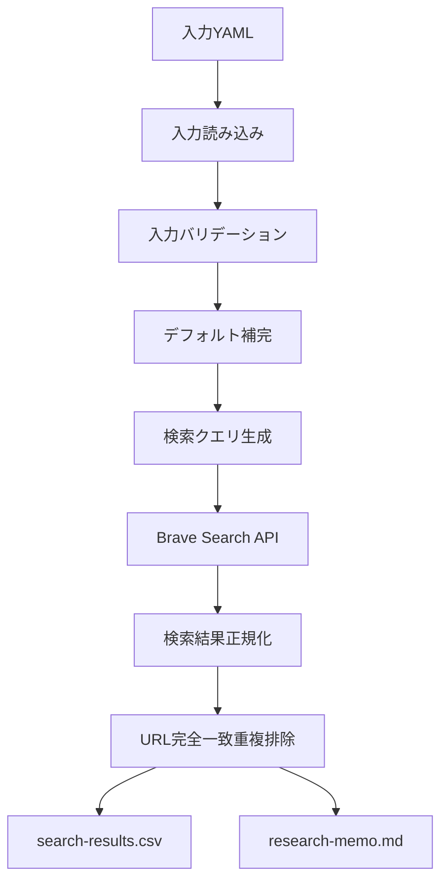

# Research Memo Builder P0実装設計書

## 1. この文書の位置づけ

この文書は、Research Memo Builder の **M1.5：P0実装設計** ドキュメントである。

M1で作成したプロジェクト雛形を前提に、P0要件定義書を実装タスクへ落とし込むため、以下の6項目を具体化する。

- 入力YAML型
- DTO
- CLI引数
- 出力ファイル構成
- エラーコード
- ディレクトリ構成

この文書は、M2以降の実装時に参照する設計メモであり、コードそのものではない。

---

## 2. P0設計方針

### 2.1 P0で実装すること

P0では、以下の流れを実装対象とする。



### 2.2 P0で実装しないこと

P0では、以下は実装しない。

| 対象外 | P0での扱い |
|---|---|
| JSON出力 | `output.json: true` は入力不正 |
| run-report出力 | `output.runReport: true` は入力不正 |
| ChatGPT分析プロンプト出力 | `output.chatgptPrompt: true` は入力不正 |
| ページング検索 | `offset` を使った追加取得はしない |
| キャッシュ | `--use-cache` は未対応 |
| 自動リトライ | API失敗時は対象クエリを失敗扱いにする |
| 高度な重複判定 | URL完全一致のみで判定する |
| 検索結果URLへのHTTPアクセス | 検索結果ページ本文は取得しない |
| note非公式API | 使用しない |
| note本文スクレイピング | 実施しない |
| 有料部分取得 | 実施しない |

---

## 3. 入力YAML型

### 3.1 入力ファイル

P0の標準入力ファイルは以下とする。

```text
research/inputs/ats-rule-spec.yaml
```

CLIでは `--input` で入力ファイルパスを指定する。

```bash
npm run research -- --input research/inputs/ats-rule-spec.yaml
```

### 3.2 入力YAMLの標準形

```yaml
topic: 家庭内ルールを書き出したら、仕様書になっていた話

articleType:
  devDiary: true
  techArticle: false
  paidNoteCandidate: false

keywords:
  - 家庭内ルール 仕様書
  - 家庭内ルール 要件定義
  - 家庭内 ポイント制度 設計
  - 子育て 仕組み化 note
  - 家庭内ルール プロダクト設計

platforms:
  - name: note
    site: note.com
  - name: Qiita
    site: qiita.com
  - name: Zenn
    site: zenn.dev

search:
  countPerQuery: 10
  country: JP
  searchLang: ja
  uiLang: ja-JP
  extraSnippets: true

output:
  dir: output/research/ats-rule-spec
  csv: true
  markdownMemo: true
  json: false
  runReport: false
  chatgptPrompt: false
```

### 3.3 Raw入力型

YAMLから読み込んだ直後の型を `RawResearchInput` とする。

`search` 配下は省略可能とし、後続の `ResolvedResearchInput` 生成時にP0既定値で補完する。

```ts
export type RawResearchInput = {
  topic?: unknown;
  articleType?: unknown;
  keywords?: unknown;
  platforms?: unknown;
  search?: unknown;
  output?: unknown;
};
```

実装上は、YAMLパース直後の値をすぐに `ResearchInput` として信用しない。必ず `validateAndResolveResearchInput` を通す。

### 3.4 バリデーション後入力型

バリデーションとデフォルト補完後の型を `ResolvedResearchInput` とする。

```ts
export type ResolvedResearchInput = {
  topic: string;
  articleType: ArticleType;
  keywords: string[];
  platforms: SearchPlatform[];
  search: SearchOptions;
  output: OutputOptions;
};
```

### 3.5 ArticleType

```ts
export type ArticleType = {
  devDiary: boolean;
  techArticle: boolean;
  paidNoteCandidate: boolean;
};
```

制約は以下。

| 項目 | 制約 |
|---|---|
| `devDiary` | boolean必須 |
| `techArticle` | boolean必須 |
| `paidNoteCandidate` | boolean必須 |
| 全体制約 | 3項目のうち最低1つは `true` |

### 3.6 SearchPlatform

```ts
export type SearchPlatform = {
  name: string;
  site: string;
};
```

制約は以下。

| 項目 | 制約 |
|---|---|
| `name` | trim後に空文字不可 |
| `site` | `note.com` のようなドメインのみ許可 |
| `site` | `https://`、`http://`、パス、クエリを禁止 |
| `platforms` | 1件以上3件以下 |
| `platforms[].site` | 重複不可。重複時は入力不正 |

`platforms[].site` は検索クエリの `site:{domain}` に直接使うため、URL形式ではなくドメイン形式に限定する。

### 3.7 SearchOptions

```ts
export type SearchOptions = {
  countPerQuery: number;
  country: string;
  searchLang: string;
  uiLang: string;
  extraSnippets: boolean;
};
```

`search` オブジェクトおよび各項目は省略可能とする。省略時は以下で補完する。

| 項目 | 既定値 | 制約 |
|---|---:|---|
| `countPerQuery` | `10` | 1以上20以下 |
| `country` | `JP` | P0では文字列として扱う |
| `searchLang` | `ja` | P0では文字列として扱う |
| `uiLang` | `ja-JP` | P0では文字列として扱う |
| `extraSnippets` | `true` | boolean |

P0ではページングしないため、`offset` は入力YAMLに持たせない。

### 3.8 OutputOptions

```ts
export type OutputOptions = {
  dir: string;
  csv: boolean;
  markdownMemo: boolean;
  json: boolean;
  runReport: boolean;
  chatgptPrompt: boolean;
};
```

制約は以下。

| 項目 | 省略時 | P0制約 |
|---|---:|---|
| `dir` | 不可 | 相対パスのみ。絶対パスと `../` を禁止 |
| `csv` | `true` | `false` は入力不正 |
| `markdownMemo` | `true` | `false` は入力不正 |
| `json` | `false` | `true` は入力不正 |
| `runReport` | `false` | `true` は入力不正 |
| `chatgptPrompt` | `false` | `true` は入力不正 |

P0対象外出力フラグは、省略可能とする。ただし、`true` が指定された場合は入力不正として停止する。

### 3.9 入力バリデーション関数

実装候補は以下。

```ts
export function validateAndResolveResearchInput(raw: unknown): ResolvedResearchInput;
```

責務は以下。

1. YAMLパース結果がobjectであることを確認する
2. 必須項目を検証する
3. 型を検証する
4. trim補正を行う
5. `search` の省略値を補完する
6. `output` の省略値を補完する
7. P0対象外出力フラグが `true` でないことを検証する
8. `ResolvedResearchInput` を返す

---

## 4. DTO設計

### 4.1 DTO一覧

P0で使うDTOは以下とする。

| DTO | 用途 | 配置候補 |
|---|---|---|
| `RawResearchInput` | YAMLパース直後の未検証入力 | `src/domain/researchInput.ts` |
| `ResolvedResearchInput` | 検証・補完後の実行用入力 | `src/domain/researchInput.ts` |
| `ArticleType` | 記事種別 | `src/domain/researchInput.ts` |
| `SearchPlatform` | 検索対象媒体 | `src/domain/searchPlatform.ts` |
| `SearchOptions` | Brave検索パラメータ | `src/domain/searchOptions.ts` |
| `OutputOptions` | 出力設定 | `src/domain/outputOptions.ts` |
| `SearchQuery` | 生成済み検索クエリ | `src/domain/searchQuery.ts` |
| `BraveSearchResultItem` | Braveレスポンスの最小受け取り型 | `src/adapters/braveSearchClient.ts` |
| `SearchQueryExecutionResult` | 1クエリ単位の実行結果 | `src/domain/searchExecution.ts` |
| `SearchQueryFailure` | 1クエリ単位の失敗情報 | `src/domain/searchExecution.ts` |
| `NormalizedSearchResult` | 正規化済み検索結果 | `src/domain/normalizedSearchResult.ts` |
| `DeduplicationResult` | 重複排除結果 | `src/domain/deduplicationResult.ts` |
| `CsvSearchResultRow` | CSV出力行 | `src/renderers/csvRenderer.ts` |
| `ResearchMemoRenderInput` | Markdown生成入力 | `src/renderers/markdownResearchMemoRenderer.ts` |
| `ResearchRunResult` | CLI終了判定用の実行結果 | `src/domain/researchRunResult.ts` |

### 4.2 SearchQuery

```ts
export type SearchQuery = {
  keyword: string;
  platform: SearchPlatform;
  query: string;
  count: number;
  country: string;
  searchLang: string;
  uiLang: string;
  extraSnippets: boolean;
};
```

生成ルールは以下。

```ts
query = `site:${platform.site} ${keyword}`
```

生成順は、`platforms` 順 × `keywords` 順とする。

### 4.3 BraveSearchResultItem

Brave Search APIレスポンスからP0で利用する最小項目だけを受け取る。

```ts
export type BraveSearchResultItem = {
  title?: string;
  url?: string;
  description?: string;
  extra_snippets?: string[];
};
```

APIレスポンス全体は、P0では永続化しない。型はアダプタ内に閉じ込める。

### 4.4 SearchQueryExecutionResult

1クエリごとの成功・失敗を表す。

```ts
export type SearchQueryExecutionResult =
  | {
      status: 'success';
      query: SearchQuery;
      items: BraveSearchResultItem[];
      retrievedAt: string;
    }
  | {
      status: 'failure';
      query: SearchQuery;
      failure: SearchQueryFailure;
      retrievedAt: string;
    };
```

### 4.5 SearchQueryFailure

```ts
export type SearchQueryFailure = {
  type: 'http_error' | 'network_error' | 'invalid_response' | 'unknown_error';
  httpStatus?: number;
  message: string;
};
```

制約は以下。

- APIキー値を `message` に含めない
- HTTPヘッダー値を保存しない
- 失敗した `query.query` とHTTPステータスは確認できるようにする

### 4.6 NormalizedSearchResult

```ts
export type NormalizedSearchResult = {
  keyword: string;
  platform: string;
  query: string;
  rank: number;
  title: string;
  url: string;
  snippet: string;
  extraSnippets: string[];
  retrievedAt: string;
};
```

P0要件定義書では `snippet?`、`extraSnippets?` としているが、P0実装設計では出力処理を単純化するため、正規化後は以下に統一する。

| 元データ | 正規化後 |
|---|---|
| `description` あり | `snippet` に設定 |
| `description` なし | `snippet: ''` |
| `extra_snippets` あり | `extraSnippets` に設定 |
| `extra_snippets` なし | `extraSnippets: []` |

### 4.7 DeduplicationResult

```ts
export type DeduplicationResult = {
  results: NormalizedSearchResult[];
  removedCount: number;
  removedUrls: string[];
};
```

P0ではURL完全一致のみで重複判定する。

### 4.8 CsvSearchResultRow

```ts
export type CsvSearchResultRow = {
  Keyword: string;
  Platform: string;
  Title: string;
  Url: string;
  Snippet: string;
  ExtraSnippets: string;
  Rank: number;
  Query: string;
  RetrievedAt: string;
};
```

`ExtraSnippets` は、配列を ` / ` で連結する。

### 4.9 ResearchMemoRenderInput

```ts
export type ResearchMemoRenderInput = {
  input: ResolvedResearchInput;
  results: NormalizedSearchResult[];
  generatedAt: string;
  queryCount: number;
  succeededQueryCount: number;
  failedQueryCount: number;
  totalResultCountBeforeDeduplication: number;
  totalResultCountAfterDeduplication: number;
};
```

P0では `run-report.md` を出力しないが、Markdown内の「P0生成メモ」に最低限の件数情報を含めるため、このDTOを使う。

### 4.10 ResearchRunResult

```ts
export type ResearchRunResult = {
  exitCode: ResearchExitCode;
  outputDir?: string;
  generatedFiles: string[];
  queryCount: number;
  succeededQueryCount: number;
  failedQueryCount: number;
  resultCount: number;
  warnings: string[];
};
```

CLI層は、このDTOを受け取って終了コードを決定する。

---

## 5. CLI引数設計

### 5.1 P0で受け付ける引数

| 引数 | 必須 | P0での扱い |
|---|---:|---|
| `--input <path>` | Yes | 入力YAMLパス |
| `--out <path>` | No | 出力先上書き。未指定時はYAMLの `output.dir` を使う |
| `--dry-run` | No | APIを呼ばず、生成クエリだけ表示する |
| `--help` | No | 使い方を表示して終了する |

M1雛形で `--out` と `--dry-run` を用意済みのため、P0設計でも任意機能として扱う。

### 5.2 P0で受け付けない引数

| 引数 | 扱い |
|---|---|
| `--use-cache` | P0対象外。指定時はエラー |
| `--json` | P0対象外。指定時はエラー |
| `--run-report` | P0対象外。指定時はエラー |
| `--chatgpt-prompt` | P0対象外。指定時はエラー |

### 5.3 CLI引数型

```ts
export type ResearchCliArgs = {
  input?: string;
  out?: string;
  dryRun: boolean;
  help: boolean;
};
```

### 5.4 実行例

基本実行。

```bash
npm run research -- --input research/inputs/ats-rule-spec.yaml
```

出力先をCLIで上書きする場合。

```bash
npm run research -- --input research/inputs/ats-rule-spec.yaml --out output/research/ats-rule-spec
```

dry-run。

```bash
npm run research -- --input research/inputs/ats-rule-spec.yaml --dry-run
```

### 5.5 dry-runの仕様

`--dry-run` 指定時は以下の処理まで行う。

1. CLI引数パース
2. 入力YAML読み込み
3. 入力バリデーション
4. デフォルト補完
5. 検索クエリ生成
6. 生成クエリ一覧を標準出力に表示
7. API呼び出し、CSV出力、Markdown出力は行わない

終了コードは、正常時 `0` とする。

---

## 6. 出力ファイル構成

### 6.1 出力ディレクトリ

P0の出力先は、原則として入力YAMLの `output.dir` を使う。

```text
output/research/ats-rule-spec/
```

`--out` が指定された場合は、CLI引数の値で `output.dir` を上書きする。

### 6.2 P0で生成するファイル

```text
output/research/ats-rule-spec/
  search-results.csv
  research-memo.md
```

### 6.3 P0で生成しないファイル

```text
output/research/ats-rule-spec/
  normalized-results.json          # P1以降
  raw-results.json                 # P1以降
  chatgpt-analysis-prompt.md       # P1以降
  run-report.md                    # P1以降
```

### 6.4 CSV仕様

ファイル名は固定で `search-results.csv` とする。

列順は以下で固定する。

```text
Keyword,Platform,Title,Url,Snippet,ExtraSnippets,Rank,Query,RetrievedAt
```

要件は以下。

| 項目 | 設計 |
|---|---|
| 文字コード | UTF-8 with BOM |
| 改行コード | LF |
| ヘッダー | 必ず出力する |
| 0件時 | ヘッダー行のみ出力する |
| 既存ファイル | 上書きする |
| エスケープ | カンマ、ダブルクォート、改行をCSV仕様に従ってエスケープする |

`ExtraSnippets` は複数要素を ` / ` で連結する。

### 6.5 Markdown仕様

ファイル名は固定で `research-memo.md` とする。

章構成は以下で固定する。

```markdown
# 既存記事リサーチメモ

## 対象記事候補

## 検索条件

## 1. 検索したキーワード

## 2. 似たタイトルがあるか

## 3. どんな切り口が多いか

## 4. 無料部分で何を約束しているか

## 5. 価格帯はいくらか

## 6. 自分ならどこで差別化できるか

## 7. 記事化判断

## 8. 次に作るなら

## P0生成メモ
```

P0生成メモには、以下の注意書きを必ず含める。

```markdown
> このメモは検索結果のタイトル・URL・スニペットをもとにしたP0下書きです。  
> 記事本文、有料部分、正確な価格情報は取得していません。  
> 切り口、無料部分の約束、価格帯は人間レビューで確認してください。
```

### 6.6 上書き方針

P0では、同名ファイルが存在する場合は上書きする。

理由は以下。

- 同じ入力から同じ出力を再生成しやすくするため
- M1〜M5の開発中に手動削除の手間を減らすため
- 履歴管理はGitまたは将来のrun-id出力で扱うため

P1以降で、タイムスタンプ付き出力やrun-idディレクトリを検討する。

---

## 7. エラーコード設計

### 7.1 終了コード一覧

| Exit Code | 名前 | ケース | 出力ファイル |
|---:|---|---|---|
| `0` | `SUCCESS` | 全処理成功。0件結果も含む | 生成する |
| `1` | `PARTIAL_API_FAILURE` | 一部クエリがAPI失敗したが、1件以上のクエリは成功 | 生成する |
| `2` | `INPUT_ERROR` | CLI引数不正、入力ファイル不正、YAML不正、入力値不正 | 生成しない |
| `3` | `CONFIG_ERROR` | `.env` または `BRAVE_API_KEY` 不備 | 生成しない |
| `4` | `ALL_API_FAILURE` | 生成クエリはあるが、全クエリのAPI呼び出しが失敗 | 可能なら空CSVとメモを生成する |
| `5` | `OUTPUT_ERROR` | 出力ディレクトリ作成失敗、ファイル書き込み失敗 | 不完全の可能性あり |
| `9` | `UNEXPECTED_ERROR` | 想定外例外 | 不定 |

### 7.2 エラーコード型

```ts
export const ResearchExitCode = {
  SUCCESS: 0,
  PARTIAL_API_FAILURE: 1,
  INPUT_ERROR: 2,
  CONFIG_ERROR: 3,
  ALL_API_FAILURE: 4,
  OUTPUT_ERROR: 5,
  UNEXPECTED_ERROR: 9,
} as const;

export type ResearchExitCode =
  (typeof ResearchExitCode)[keyof typeof ResearchExitCode];
```

### 7.3 0件時の扱い

全クエリが成功し、検索結果が0件の場合はエラーにしない。

| 項目 | 扱い |
|---|---|
| Exit Code | `0` |
| CSV | ヘッダー行のみ出力 |
| Markdown | 「検索結果候補なし」と明記 |
| 標準出力 | `0 results` を表示 |

### 7.4 一部失敗時の扱い

一部クエリが失敗し、1件以上のクエリが成功した場合は部分失敗とする。

| 項目 | 扱い |
|---|---|
| Exit Code | `1` |
| CSV | 成功クエリの結果のみ出力 |
| Markdown | 成功クエリの結果のみ出力し、P0生成メモに失敗クエリ数を記載 |
| 標準エラー | 失敗クエリとHTTPステータスを表示 |

P0では `run-report.md` を出力しないため、詳細な失敗記録は標準エラーに留める。

### 7.5 全失敗時の扱い

すべてのクエリがAPI失敗した場合は全失敗とする。

| 項目 | 扱い |
|---|---|
| Exit Code | `4` |
| CSV | 可能であればヘッダー行のみ出力 |
| Markdown | 可能であれば全クエリ失敗を明記したメモを出力 |
| 標準エラー | 失敗理由の概要を表示 |

出力ディレクトリ作成またはファイル書き込みにも失敗した場合は、`OUTPUT_ERROR = 5` を優先する。

### 7.6 APIキー関連エラー

`BRAVE_API_KEY` 未設定時はAPIを呼ばずに停止する。

| 項目 | 扱い |
|---|---|
| Exit Code | `3` |
| 出力ファイル | 生成しない |
| 標準エラー | `.env` と `BRAVE_API_KEY` の確認を促す |
| 禁止 | APIキー実値の表示 |

### 7.7 入力不正エラー

入力不正時はAPIを呼ばずに停止する。

| 項目 | 扱い |
|---|---|
| Exit Code | `2` |
| 出力ファイル | 生成しない |
| 標準エラー | 不正な項目名と修正方針を表示 |

---

## 8. ディレクトリ構成

### 8.1 P0実装後の構成

```text
research-memo-builder/
  package.json
  tsconfig.json
  .env
  .env.example
  .gitignore

  docs/
    research/
      research-memo-builder-plan.md
      research-memo-builder-p0-requirements.md
      research-memo-builder-p0-design.md

  research/
    inputs/
      ats-rule-spec.yaml

  src/
    cli/
      research.ts

    application/
      runResearchUseCase.ts

    config/
      env.ts

    domain/
      researchInput.ts
      searchPlatform.ts
      searchOptions.ts
      outputOptions.ts
      searchQuery.ts
      searchExecution.ts
      normalizedSearchResult.ts
      deduplicationResult.ts
      researchRunResult.ts
      researchExitCode.ts

    input/
      researchInputLoader.ts
      researchInputValidator.ts

    adapters/
      braveSearchClient.ts

    services/
      searchQueryBuilder.ts
      searchResultNormalizer.ts
      deduplicationService.ts

    renderers/
      csvRenderer.ts
      markdownResearchMemoRenderer.ts

    repositories/
      fileOutputRepository.ts

    utils/
      csvEscape.ts
      markdownEscape.ts
      safePath.ts

  output/
    research/
```

### 8.2 責務分担

| パス | 責務 |
|---|---|
| `src/cli/research.ts` | CLI引数パース、UseCase呼び出し、終了コード反映 |
| `src/application/runResearchUseCase.ts` | P0処理全体のオーケストレーション |
| `src/config/env.ts` | `.env` 読み込み、`BRAVE_API_KEY` 検証 |
| `src/input/researchInputLoader.ts` | YAMLファイル読み込み、パース |
| `src/input/researchInputValidator.ts` | 入力検証、デフォルト補完 |
| `src/services/searchQueryBuilder.ts` | `site:{domain} {keyword}` クエリ生成 |
| `src/adapters/braveSearchClient.ts` | Brave Search API呼び出し |
| `src/services/searchResultNormalizer.ts` | Braveレスポンスから `NormalizedSearchResult` へ変換 |
| `src/services/deduplicationService.ts` | URL完全一致重複排除 |
| `src/renderers/csvRenderer.ts` | CSV文字列生成 |
| `src/renderers/markdownResearchMemoRenderer.ts` | Markdown文字列生成 |
| `src/repositories/fileOutputRepository.ts` | ディレクトリ作成、ファイル書き込み |
| `src/utils/csvEscape.ts` | CSV値エスケープ |
| `src/utils/markdownEscape.ts` | Markdown表示用エスケープ |
| `src/utils/safePath.ts` | 出力パス検証 |

### 8.3 P1以降で追加する候補

```text
src/
  renderers/
    jsonRenderer.ts
    runReportRenderer.ts
    chatgptPromptRenderer.ts

  repositories/
    cacheRepository.ts

  services/
    advancedDeduplicationService.ts
```

P0では作成しない。

---

## 9. 実装タスク分解

### 9.1 M2：入力・環境・単一検索

| Task | 内容 | Exit条件 |
|---|---|---|
| M2-1 | `env.ts` 作成 | `.env` から `BRAVE_API_KEY` を読み込める |
| M2-2 | `researchInputLoader.ts` 作成 | YAMLファイルを読み込める |
| M2-3 | `researchInputValidator.ts` 作成 | `ResolvedResearchInput` を生成できる |
| M2-4 | `searchQueryBuilder.ts` 作成 | 1キーワード×1媒体のクエリを生成できる |
| M2-5 | `braveSearchClient.ts` 作成 | 1クエリをBrave Search APIへ送信できる |
| M2-6 | APIキー未設定エラー実装 | APIキーなしでExit Code 3になる |

### 9.2 M3：複数検索・正規化・重複排除

| Task | 内容 | Exit条件 |
|---|---|---|
| M3-1 | 複数クエリ生成 | 5キーワード×3媒体で15クエリを生成できる |
| M3-2 | 逐次実行 | クエリを順番にAPI実行できる |
| M3-3 | `searchResultNormalizer.ts` 作成 | `NormalizedSearchResult` に変換できる |
| M3-4 | `deduplicationService.ts` 作成 | URL完全一致を1件に統合できる |
| M3-5 | 部分失敗制御 | 一部API失敗でも継続できる |
| M3-6 | 全失敗制御 | 全API失敗時にExit Code 4になる |

### 9.3 M4：CSV出力

| Task | 内容 | Exit条件 |
|---|---|---|
| M4-1 | `csvEscape.ts` 作成 | カンマ、改行、ダブルクォートを正しく扱える |
| M4-2 | `csvRenderer.ts` 作成 | 指定列順でCSV文字列を生成できる |
| M4-3 | BOM付きUTF-8出力 | 日本語CSVを想定したBOM付き出力ができる |
| M4-4 | 0件CSV | 0件時もヘッダー行のみ出力できる |

### 9.4 M5：Markdown出力

| Task | 内容 | Exit条件 |
|---|---|---|
| M5-1 | `markdownEscape.ts` 作成 | タイトル等のMarkdown崩れを抑制できる |
| M5-2 | `markdownResearchMemoRenderer.ts` 作成 | 指定章構成でMarkdownを生成できる |
| M5-3 | 似たタイトル一覧 | タイトル、URL、媒体、キーワード、スニペットを出力できる |
| M5-4 | P0注意書き | 本文・有料部分・価格未取得の注意書きを出力できる |
| M5-5 | 0件Markdown | 0件時も確認用メモを生成できる |

---

## 10. 実装時の判定ルールまとめ

| 判定対象 | P0ルール |
|---|---|
| 検索クエリ数 | `keywords.length × platforms.length` |
| 取得件数 | `countPerQuery`。既定値10、上限20 |
| ページング | しない |
| 検索結果URLへのアクセス | しない |
| 重複判定 | URL完全一致のみ |
| CSV | UTF-8 with BOM、固定列、上書き |
| Markdown | 固定章構成、要確認欄あり |
| 0件 | 成功扱い、Exit Code 0 |
| 部分API失敗 | Exit Code 1、成功分で出力 |
| 全API失敗 | Exit Code 4、可能なら空出力 |
| 入力不正 | Exit Code 2、API呼び出しなし |
| APIキー不備 | Exit Code 3、API呼び出しなし |
| 出力失敗 | Exit Code 5 |

---

## 11. 未決事項

P0実装前に、以下は最終確認する。

| ID | 未決事項 | 推奨方針 |
|---|---|---|
| TBD-001 | 入力バリデーションをZodで行うか、手書きで行うか | P0では手書きでも可。P1でZod検討 |
| TBD-002 | CLI引数パーサーを使うか、自前で実装するか | P0では自前でも可。拡張時にcommander等を検討 |
| TBD-003 | HTTPクライアントをNode標準fetchにするか | P0ではNode標準fetchを推奨 |
| TBD-004 | CSVライブラリを使うか | P0では自前実装で可。複雑化したらライブラリ検討 |
| TBD-005 | `--out` を正式P0仕様に含めるか | M1雛形互換として任意実装にする |

---

## 12. P0設計完了条件

この設計ドキュメントは、以下を満たした時点で完了とする。

- 入力YAMLのRaw型とResolved型が定義されている
- P0対象外出力フラグの扱いが定義されている
- DTO一覧と責務が定義されている
- CLI引数とdry-runの扱いが定義されている
- P0出力ファイルと上書き方針が定義されている
- CSVの列、文字コード、0件時の扱いが定義されている
- Markdownの章構成と注意書きが定義されている
- Exit Codeが定義されている
- ディレクトリ構成とファイル責務が定義されている
- M2〜M5へ落とせる実装タスクが定義されている
