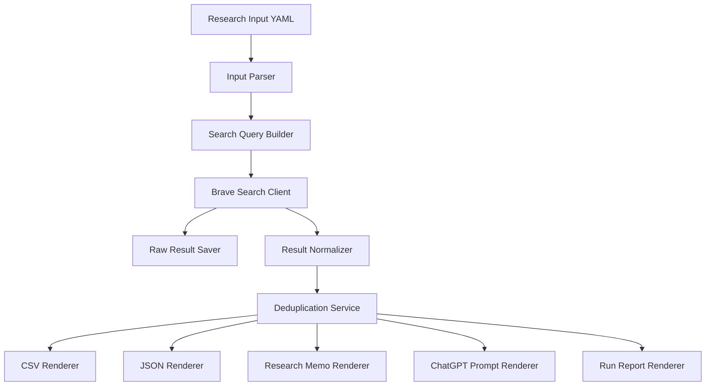
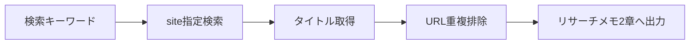
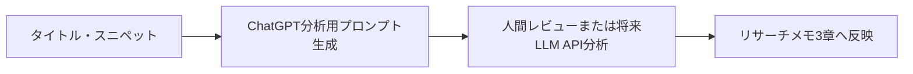
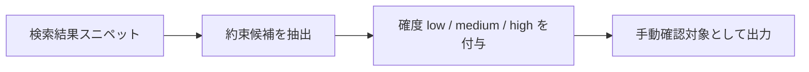
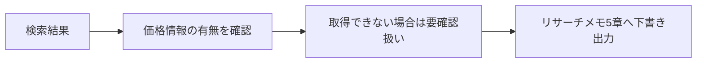
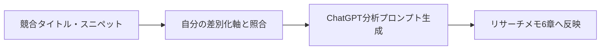

# note記事投稿前リサーチ自動化 TypeScript CLI 企画書

## 1. 企画名

**Research Memo Builder**

副題：
**Brave Search APIを使って、note記事投稿前の既存記事リサーチを半自動化するTypeScript CLI**

---

## 2. 背景

note記事投稿前に、既存記事のリサーチを行っている。

現在のリサーチ観点は以下である。

- 似たタイトルがあるか
- どんな切り口が多いか
- 無料部分で何を約束しているか
- 価格帯はいくらか
- 自分ならどこで差別化できるか
- 記事化すべきか
- 次に作るなら、どのような読者・困りごと・約束にするか

当初は、noteの非公式APIやGoogle Custom Search JSON APIの利用を検討した。

しかし、noteには公式公開APIがなく、非公式APIは仕様変更・停止リスクが高い。
また、Google Custom Search JSON APIも新規ユーザー利用不可・サービス終了予定であるため、新規の運用基盤としては採用しない。

そのため、検索エンジンAPIとして **Brave Search API** を採用し、`site:note.com`、`site:qiita.com`、`site:zenn.dev` などの検索をTypeScript CLIから実行する。

---

## 3. 目的

本企画の目的は、note記事投稿前の既存記事リサーチを、毎回手作業で検索・整理する状態から脱却することである。

具体的には、記事ネタと検索キーワード候補を入力すると、以下を自動生成する。

- 検索実行ログ
- 既存記事候補一覧
- タイトル・URL・スニペット一覧
- 媒体別の候補整理
- リサーチメモMarkdown下書き
- ChatGPTに渡しやすい分析用プロンプト
- 将来的には、LLMによる切り口・差別化・記事化判断の自動下書き

---

## 4. 対象記事種別

対象とする記事種別は以下の3つである。

| 記事種別           | 内容                                                                   |
| ------------------ | ---------------------------------------------------------------------- |
| ATS開発日記        | 家庭内ポイント制度ATSの悩み・判断・運用・開発過程を扱う記事            |
| ATS技術記事        | LINE Bot、DB、UseCase、設計、実装、運用改善を扱う記事                  |
| 将来の有料note候補 | テンプレート、チェックリスト、設計手順、実践パッケージ化を見据えた記事 |

---

## 5. 採用技術

| 項目        | 採用                  |
| ----------- | --------------------- |
| 言語        | TypeScript            |
| 実行環境    | Node.js               |
| 検索API     | Brave Search API      |
| 入力形式    | YAML または JSON      |
| 出力形式    | Markdown / CSV / JSON |
| APIキー管理 | `.env`                |
| 設定管理    | `config/*.yaml`       |
| 実行方法    | npm scripts           |
| 将来連携    | LLM API / Mnemosyne   |

---

## 6. TypeScriptを採用する理由

### 6.1 APIキー設定の手間を減らせる

PowerShellでは、毎回環境変数を設定したり、実行環境ごとにスクリプトを管理したりする必要がある。

TypeScript CLIでは、`.env` に以下のように設定しておけばよい。

```env
BRAVE_API_KEY=xxxxxxxxxxxxxxxx
```

以降は、以下のコマンドだけで実行できる。

```bash
npm run research -- --input research/inputs/ats-rule-spec.yaml
```

### 6.2 DTOでデータ構造を固定できる

リサーチ結果は、検索APIのレスポンスをそのまま使うのではなく、内部DTOに正規化する。

これにより、将来APIをBraveからTavily、Exa、別APIに変更しても、リサーチメモ生成側への影響を抑えられる。

### 6.3 ATS / Mnemosyneの既存文脈と相性がよい

既存プロジェクトでTypeScript、UseCase、Repository、DTO、CLIの考え方を使っているため、今回の自動化も同じ設計思想で育てやすい。

### 6.4 PowerShellより保守しやすい

PowerShellは試作には向いているが、以下が増えると管理が難しくなる。

- 複数媒体検索
- 入力ファイル管理
- キャッシュ
- Markdown生成
- LLM分析
- エラー処理
- テスト
- 将来のMnemosyne連携

最初から継続運用を見据えるなら、TypeScriptの方が適している。

---

## 7. PowerShell案をやめた理由

当初は、Phase 1として「PowerShell + Brave Search API」で検索結果CSVを作る案を検討した。

しかし、以下の理由で採用しない。

| 理由                       | 内容                                                           |
| -------------------------- | -------------------------------------------------------------- |
| APIキー管理が面倒          | 毎回環境変数を設定する運用は継続しづらい                       |
| スクリプトが肥大化しやすい | キーワード、媒体、出力形式が増えるとPowerShellが読みにくくなる |
| 型が弱い                   | 検索結果DTO、リサーチメモDTO、出力DTOを安全に扱いづらい        |
| テストしづらい             | 正規化処理やMarkdown生成の回帰確認がしづらい                   |
| 将来拡張に弱い             | LLM連携、キャッシュ、Mnemosyne連携に進むと構成が苦しくなる     |
| 既存開発スタイルと合わない | ATS/Mnemosyneの設計資産を活かしにくい                          |

したがって、PowerShellは使わず、最初からTypeScript CLIとして構築する。

---

## 8. ChatGPTにCSVを貼る案をやめた理由

当初は、Phase 2として「検索結果CSVをChatGPTに貼って、リサーチメモを作る」案を検討した。

しかし、以下の理由で採用しない。

| 理由                       | 内容                                                                     |
| -------------------------- | ------------------------------------------------------------------------ |
| 手作業が残る               | CSVを開く、コピーする、貼る、プロンプトを整える作業が残る                |
| 再現性が低い               | 毎回貼り方や指示が微妙に変わり、出力品質が揺れる                         |
| 入力漏れが起きる           | CSVの一部だけ貼る、キーワード情報を貼り忘れるなどが起きやすい            |
| 履歴管理しにくい           | どの検索結果からどの判断をしたか追跡しづらい                             |
| 将来の自動化に繋がりにくい | LLM API連携やMnemosyne連携に進むなら、最初から構造化データで持つ方がよい |

そのため、CSV貼り付け運用は中間ステップとして採用しない。

ただし、MVP段階ではLLM API連携までは必須としない。
代わりに、CLIが以下を出力する。

- リサーチメモMarkdown
- ChatGPTに貼るための分析プロンプトMarkdown
- 検索結果JSON
- 検索結果CSV

これにより、手動分析にも自動分析にも進められる状態を作る。

---

## 9. MVPスコープ

### 9.1 MVPでやること

| 機能                      | 内容                                                       |
| ------------------------- | ---------------------------------------------------------- |
| 入力ファイル読み込み      | 記事ネタ、記事種別、検索キーワード、対象媒体をYAMLで指定   |
| Brave Search実行          | `site:note.com` などの検索クエリを生成してAPI実行          |
| 検索結果正規化            | タイトル、URL、説明文、追加スニペット、媒体を内部DTOへ変換 |
| 重複排除                  | 同一URL、同一タイトルを整理                                |
| CSV出力                   | 検索結果一覧をCSV化                                        |
| JSON出力                  | 生データと正規化データを保存                               |
| Markdown出力              | 既存記事リサーチメモの下書きを生成                         |
| ChatGPT分析プロンプト出力 | 取得結果をもとに、手動LLM分析しやすいプロンプトを生成      |

### 9.2 MVPでやらないこと

| 対象外                    | 理由                                      |
| ------------------------- | ----------------------------------------- |
| note非公式API利用         | 仕様変更・停止リスクが高い                |
| note本文スクレイピング    | 規約・robots.txt・著作権リスクを避ける    |
| 有料部分取得              | 明確に対象外                              |
| 価格の完全自動取得        | 検索結果だけでは安定取得できない          |
| LLM APIによる完全自動分析 | 初期MVPではコスト・設計範囲を広げすぎない |
| Web UI                    | CLIで十分検証可能                         |
| データベース保存          | まずはファイル出力でよい                  |

---

## 10. 入力ファイル例

```yaml
topic: 家庭内ルールを書き出したら、仕様書になっていた話

articleType:
  devDiary: true
  techArticle: false
  paidNoteCandidate: false

keywords:
  - 家庭内ルール 仕様書
  - 家庭内ルール 要件定義
  - 家庭内 ポイント制度 設計
  - 子育て 仕組み化 note
  - 家庭内ルール プロダクト設計

platforms:
  - name: note
    site: note.com
  - name: Qiita
    site: qiita.com
  - name: Zenn
    site: zenn.dev

search:
  countPerQuery: 10
  country: JP
  searchLang: ja
  uiLang: ja-JP
  extraSnippets: true

output:
  dir: output/research/ats-rule-spec
  csv: true
  json: true
  markdownMemo: true
  chatgptPrompt: true
```

---

## 11. 出力ファイル

```text
output/research/ats-rule-spec/
  search-results.csv
  normalized-results.json
  raw-results.json
  research-memo.md
  chatgpt-analysis-prompt.md
  run-report.md
```

### 11.1 search-results.csv

検索結果を一覧確認するためのCSV。

主な列は以下。

- Keyword
- Platform
- Title
- Url
- Snippet
- ExtraSnippets
- Rank
- Query
- RetrievedAt

### 11.2 normalized-results.json

プログラム内部で扱いやすい正規化済みデータ。

### 11.3 raw-results.json

Brave Search APIのレスポンスを保存するデバッグ用データ。

### 11.4 research-memo.md

既存記事リサーチメモの下書き。

### 11.5 chatgpt-analysis-prompt.md

ChatGPTに渡して分析するためのプロンプト。

### 11.6 run-report.md

検索実行条件、取得件数、エラー、除外件数を記録するレポート。

---

## 12. 内部DTO案

### 12.1 ResearchInput

```ts
export type ResearchInput = {
  topic: string;
  articleType: {
    devDiary: boolean;
    techArticle: boolean;
    paidNoteCandidate: boolean;
  };
  keywords: string[];
  platforms: SearchPlatform[];
  search: SearchOptions;
  output: OutputOptions;
};
```

### 12.2 SearchPlatform

```ts
export type SearchPlatform = {
  name: string;
  site: string;
};
```

### 12.3 NormalizedSearchResult

```ts
export type NormalizedSearchResult = {
  keyword: string;
  platform: string;
  query: string;
  rank: number;
  title: string;
  url: string;
  snippet?: string;
  extraSnippets?: string[];
  retrievedAt: string;
};
```

### 12.4 ResearchMemoDraft

```ts
export type ResearchMemoDraft = {
  topic: string;
  articleType: {
    devDiary: boolean;
    techArticle: boolean;
    paidNoteCandidate: boolean;
  };
  searchedKeywords: string[];
  similarTitleCandidates: SimilarTitleCandidate[];
  angleDrafts: AngleDraft[];
  freePartPromiseDrafts: FreePartPromiseDraft[];
  priceDrafts: PriceDraft[];
  differentiationDraft: DifferentiationDraft;
  articleDecisionDraft: ArticleDecisionDraft;
};
```

---

## 13. 全体ワークフロー



---

## 14. 取得情報ごとのフロー

### 14.1 似たタイトルがあるか



### 14.2 どんな切り口が多いか



### 14.3 無料部分で何を約束しているか



### 14.4 価格帯はいくらか



### 14.5 差別化判断



---

## 15. ディレクトリ構成案

```text
research-memo-builder/
  package.json
  tsconfig.json
  .env
  .env.example
  .gitignore

  config/
    default-platforms.yaml

  research/
    inputs/
      ats-rule-spec.yaml

  src/
    cli/
      research.ts

    config/
      env.ts

    domain/
      researchInput.ts
      searchPlatform.ts
      normalizedSearchResult.ts
      researchMemoDraft.ts

    adapters/
      braveSearchClient.ts

    services/
      searchQueryBuilder.ts
      searchResultNormalizer.ts
      deduplicationService.ts
      researchMemoDraftService.ts

    renderers/
      csvRenderer.ts
      jsonRenderer.ts
      markdownResearchMemoRenderer.ts
      chatgptPromptRenderer.ts
      runReportRenderer.ts

    repositories/
      fileOutputRepository.ts

    utils/
      safeFileName.ts
      markdownEscape.ts
      sleep.ts

  output/
    research/
```

---

## 16. CLI仕様案

### 16.1 基本実行

```bash
npm run research -- --input research/inputs/ats-rule-spec.yaml
```

### 16.2 出力先を指定

```bash
npm run research -- --input research/inputs/ats-rule-spec.yaml --out output/research/ats-rule-spec
```

### 16.3 dry-run

```bash
npm run research -- --input research/inputs/ats-rule-spec.yaml --dry-run
```

dry-runではAPIを呼ばず、生成される検索クエリだけを確認する。

### 16.4 キャッシュ利用

```bash
npm run research -- --input research/inputs/ats-rule-spec.yaml --use-cache
```

---

## 17. npm scripts案

```json
{
  "scripts": {
    "research": "tsx src/cli/research.ts",
    "typecheck": "tsc --noEmit",
    "format": "prettier --write \"src/**/*.ts\" \"research/**/*.yaml\"",
    "format:check": "prettier --check \"src/**/*.ts\" \"research/**/*.yaml\"",
    "check": "npm run typecheck && npm run format:check"
  }
}
```

---

## 18. APIキー管理方針

### 18.1 `.env`

```env
BRAVE_API_KEY=your-brave-api-key
```

### 18.2 `.env.example`

```env
BRAVE_API_KEY=
```

### 18.3 `.gitignore`

```gitignore
.env
output/
```

### 18.4 方針

- APIキーはコードに直接書かない
- `.env` はGit管理しない
- `.env.example` のみGit管理する
- 起動時に `BRAVE_API_KEY` がなければ明示的にエラーにする

---

## 19. エラー処理方針

| ケース          | 処理                             |
| --------------- | -------------------------------- |
| APIキー未設定   | 即停止                           |
| 入力YAML不正    | 即停止                           |
| Brave APIエラー | 対象クエリのみ失敗扱いにして継続 |
| レート制限      | 待機または失敗として記録         |
| 結果0件         | エラーではなく0件として記録      |
| 出力失敗        | 即停止                           |
| 重複URL         | 1件に統合                        |

---

## 20. レート制限・コスト対策

- 1クエリごとに待機時間を入れる
- 同じキーワード・同じ媒体の検索結果はキャッシュする
- 初期値は1キーワード×1媒体あたり10件
- 1記事候補あたりの検索数を制限する
- まずはnote / Qiita / Zennの3媒体までにする
- 価格情報や本文取得のための追加アクセスはMVP対象外とする

---

## 21. 初期検索対象

### 21.1 note

```text
site:note.com 家庭内ルール 仕様書
site:note.com 家庭内ルール 要件定義
site:note.com 家庭内 ポイント制度 設計
site:note.com 子育て 仕組み化 note
site:note.com 家庭内ルール プロダクト設計
```

### 21.2 Qiita

```text
site:qiita.com 家庭内ルール 仕様書
site:qiita.com 家庭内ルール 要件定義
site:qiita.com 家庭内 ポイント制度 設計
site:qiita.com 子育て 仕組み化 note
site:qiita.com 家庭内ルール プロダクト設計
```

### 21.3 Zenn

```text
site:zenn.dev 家庭内ルール 仕様書
site:zenn.dev 家庭内ルール 要件定義
site:zenn.dev 家庭内 ポイント制度 設計
site:zenn.dev 子育て 仕組み化 note
site:zenn.dev 家庭内ルール プロダクト設計
```

---

## 22. 生成するリサーチメモの扱い

MVPでは、リサーチメモを完全自動完成させるのではなく、以下の状態を目指す。

| 章                              | MVPでの生成方針                |
| ------------------------------- | ------------------------------ |
| 1. 検索したキーワード           | 自動入力                       |
| 2. 似たタイトルがあるか         | 自動入力                       |
| 3. どんな切り口が多いか         | ChatGPT分析プロンプトを生成    |
| 4. 無料部分で何を約束しているか | スニペットから要確認候補を生成 |
| 5. 価格帯はいくらか             | 要確認欄を生成                 |
| 6. 自分ならどこで差別化できるか | 固定差別化軸を自動出力         |
| 7. 記事化判断                   | 判定テンプレートを自動出力     |
| 8. 次に作るなら                 | ChatGPT分析プロンプトを生成    |

---

## 23. 将来拡張

### 23.1 LLM API連携

将来的には、取得した検索結果をLLM APIに渡し、以下を自動下書きする。

- 似ている点
- 違う点
- よくある切り口
- 無料部分で約束していそうなこと
- 差別化ポイント
- 記事化判断
- 次に作るなら

### 23.2 note RSS連携

参考クリエイターやマガジンのRSSを登録し、検索APIでは拾いにくい記事を定点観測する。

### 23.3 手動URL投入

検索結果に出ないが気になるnote記事を、手動URLとして入力できるようにする。

```yaml
manualUrls:
  - https://note.com/example/n/example
```

### 23.4 Mnemosyne連携

リサーチ結果を記事候補ごとに記憶化する。

保存候補は以下。

- article_note
- research_result
- decision
- idea
- next_action

---

## 24. マイルストーン

### M0：企画確定

完了条件：

- 本企画書の方針が確定している
- PowerShell案とCSV貼り付け案を採用しない理由が明確になっている
- TypeScript CLIとして作ることが決まっている

### M1：プロジェクト雛形作成

完了条件：

- `package.json`
- `tsconfig.json`
- `.env.example`
- `src/cli/research.ts`
- `research/inputs/ats-rule-spec.yaml`

が作成されている。

### M2：Brave Search API接続

完了条件：

- `.env` の `BRAVE_API_KEY` を使って検索できる
- 1キーワード×1媒体の検索結果を取得できる
- APIキー未設定時に明確なエラーが出る

### M3：複数キーワード・複数媒体検索

完了条件：

- 5キーワード×3媒体を一括検索できる
- 検索結果を正規化できる
- 重複URLを除外できる

### M4：CSV / JSON出力

完了条件：

- `search-results.csv`
- `normalized-results.json`
- `raw-results.json`

を出力できる。

### M5：Markdownリサーチメモ出力

完了条件：

- `research-memo.md` を生成できる
- 既存のリサーチメモテンプレートに沿っている
- 1章、2章、6章、7章の下書きが埋まる

### M6：ChatGPT分析プロンプト出力

完了条件：

- `chatgpt-analysis-prompt.md` を生成できる
- 検索結果を貼り直さなくても分析依頼できる構成になっている
- 3章、4章、8章を埋めるための指示が含まれている

---

## 25. 成功条件

このツールの成功条件は以下。

| 項目       | 成功条件                                            |
| ---------- | --------------------------------------------------- |
| 作業時間   | 1記事あたり15分以内でリサーチ準備が完了する         |
| 手作業削減 | 検索結果のコピペ作業がほぼ不要になる                |
| 再現性     | 同じ入力ファイルから同じ形式の出力が得られる        |
| 安全性     | note非公式APIや本文スクレイピングに依存しない       |
| 拡張性     | LLM API、RSS、Mnemosyne連携に進める構成になっている |
| 継続性     | APIキーを毎回設定せずに運用できる                   |

---

## 26. 初期実装の優先順位

| 優先度 | 機能                               |
| ------ | ---------------------------------- |
| P0     | `.env` によるBrave APIキー読み込み |
| P0     | 入力YAML読み込み                   |
| P0     | Brave Search API接続               |
| P0     | 検索結果の正規化                   |
| P0     | CSV出力                            |
| P0     | Markdownリサーチメモ出力           |
| P1     | JSON出力                           |
| P1     | 実行レポート出力                   |
| P1     | 重複排除                           |
| P1     | ChatGPT分析プロンプト出力          |
| P2     | キャッシュ                         |
| P2     | RSS連携                            |
| P2     | 手動URL投入                        |
| P3     | LLM API連携                        |
| P3     | Mnemosyne連携                      |

---

## 27. リスクと対策

| リスク                           | 対策                                                       |
| -------------------------------- | ---------------------------------------------------------- |
| Brave Search APIの料金・仕様変更 | APIアダプタを分離し、Tavily/Exa等へ差し替え可能にする      |
| 検索結果にノイズが多い           | `site:` 指定、キーワード調整、媒体別出力で確認しやすくする |
| 価格情報が取れない               | MVPでは手動確認欄として扱う                                |
| 無料部分の約束が正確に取れない   | スニペットからの推定に留め、確定情報として扱わない         |
| 本文取得リスク                   | note本文スクレイピングはMVP対象外にする                    |
| 出力が増えすぎる                 | 1キーワード×1媒体あたり10件を初期値にする                  |
| ツールが大きくなりすぎる         | CLI、Adapter、Service、Rendererに責務分離する              |

---

## 28. 最終方針

本ツールは、PowerShell試作やCSV貼り付け運用を挟まず、最初からTypeScript CLIとして構築する。

理由は、今回の目的が一度きりの検索ではなく、記事制作プロセスの継続的な効率化だからである。

初期MVPでは、Brave Search APIから検索結果を取得し、CSV、JSON、Markdownリサーチメモ、ChatGPT分析プロンプトを出力する。

LLM API連携、RSS連携、Mnemosyne連携は、MVP後の拡張とする。
