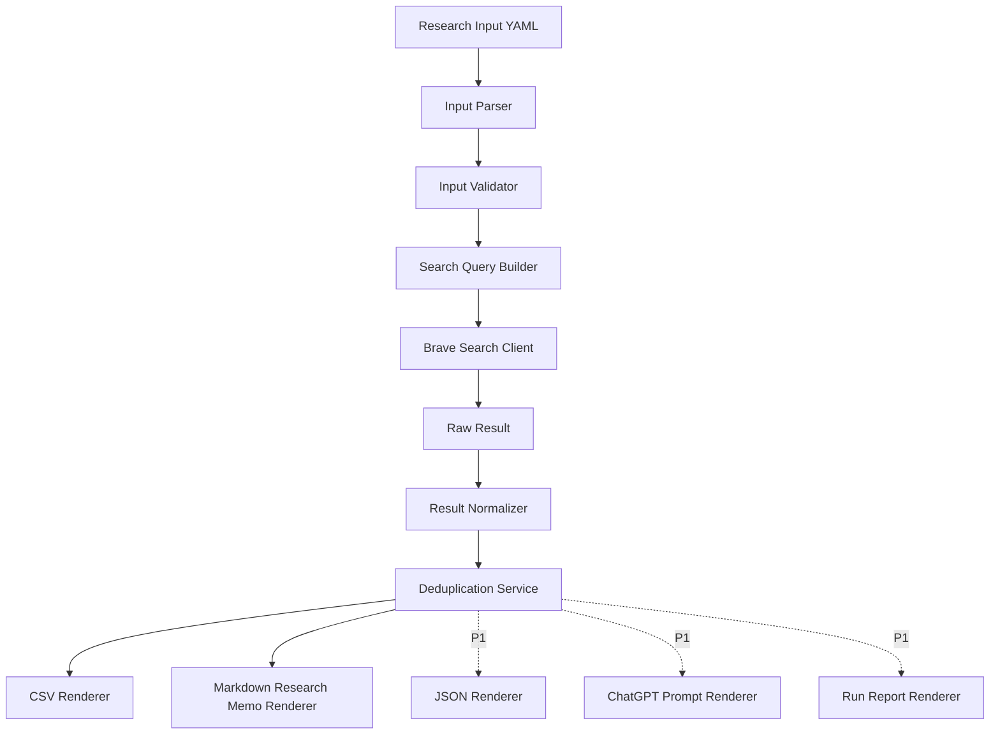
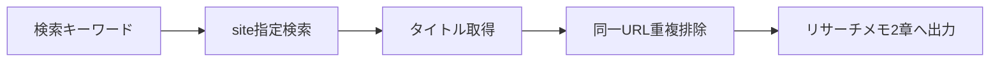
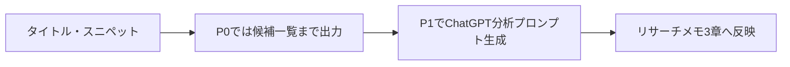
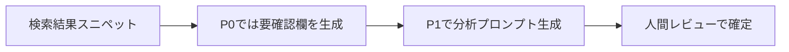
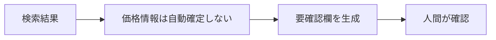
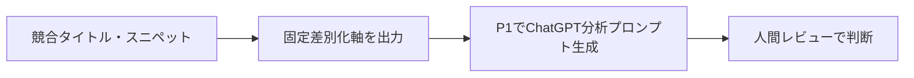

---

title: note記事投稿前リサーチ自動化 TypeScript CLI 企画書
document_id: research-memo-builder-plan
status: active
version: 1.0.0
updated: 2026-06-15
project: Research Memo Builder
------------------------------

# note記事投稿前リサーチ自動化 TypeScript CLI 企画書

## 1. 企画名

**Research Memo Builder**

副題：

**Brave Search APIを使って、note記事投稿前の既存記事リサーチを半自動化するTypeScript CLI**

---

## 2. この文書の位置づけ

この文書は、Research Memo Builder の企画書である。

本企画書では、以下を定義する。

* 背景
* 目的
* 採用方針
* 対象範囲
* MVP全体像
* P0初期実装スコープ
* 対象外
* リスク
* マイルストーン
* 成功条件

個別のP0実装要件は、以下の別文書に切り出す。

```text
docs/research/research-memo-builder-p0-requirements.md
```

このP0要件定義文書では、以下を扱う。

* 入力要件
* 検索要件
* 正規化要件
* 出力要件
* エラー処理要件
* APIキー管理要件
* 受け入れ条件

---

## 3. 背景

note記事投稿前に、既存記事のリサーチを行っている。

現在のリサーチ観点は以下である。

* 似たタイトルがあるか
* どんな切り口が多いか
* 無料部分で何を約束しているか
* 価格帯はいくらか
* 自分ならどこで差別化できるか
* 記事化すべきか
* 次に作るなら、どのような読者・困りごと・約束にするか

当初は、noteの非公式APIやGoogle Custom Search JSON APIの利用を検討した。

しかし、noteには公式公開APIがない。
また、noteの非公式APIは、仕様変更・停止リスクが高く、長期運用の中核には向かない。

さらに、Google Custom Search JSON APIも新規ユーザー利用不可・サービス終了予定であるため、新規の運用基盤としては採用しない。

そのため、本ツールでは検索エンジンAPIとして **Brave Search API** を採用し、`site:note.com`、`site:qiita.com`、`site:zenn.dev` などの検索をTypeScript CLIから実行する。

---

## 4. 目的

本企画の目的は、note記事投稿前の既存記事リサーチを、毎回手作業で検索・整理する状態から脱却することである。

具体的には、記事ネタと検索キーワード候補を入力すると、以下を生成できる状態を目指す。

* 検索実行ログ
* 既存記事候補一覧
* タイトル・URL・スニペット一覧
* 媒体別の候補整理
* リサーチメモMarkdown下書き
* ChatGPTに渡しやすい分析用プロンプト
* 将来的には、LLMによる切り口・差別化・記事化判断の自動下書き

---

## 5. 対象記事種別

対象とする記事種別は以下の3つである。

| 記事種別        | 内容                                  |
| ----------- | ----------------------------------- |
| ATS開発日記     | 家庭内ポイント制度ATSの悩み・判断・運用・開発過程を扱う記事     |
| ATS技術記事     | LINE Bot、DB、UseCase、設計、実装、運用改善を扱う記事 |
| 将来の有料note候補 | テンプレート、チェックリスト、設計手順、実践パッケージ化を見据えた記事 |

---

## 6. 採用技術

| 項目      | 採用                             |
| ------- | ------------------------------ |
| 言語      | TypeScript                     |
| 実行環境    | Node.js                        |
| 検索API   | Brave Search API               |
| 入力形式    | YAML                           |
| 出力形式    | Markdown / CSV / JSON          |
| APIキー管理 | `.env`                         |
| 設定管理    | `config/*.yaml`                |
| 実行方法    | npm scripts                    |
| 将来連携    | LLM API / note RSS / Mnemosyne |

---

## 7. TypeScriptを採用する理由

### 7.1 APIキー設定の手間を減らせる

PowerShellでは、毎回環境変数を設定したり、実行環境ごとにスクリプトを管理したりする必要がある。

TypeScript CLIでは、`.env` に以下のように設定しておけばよい。

```env
BRAVE_API_KEY=xxxxxxxxxxxxxxxx
```

以降は、以下のコマンドだけで実行できる。

```bash
npm run research -- --input research/inputs/ats-rule-spec.yaml
```

### 7.2 DTOでデータ構造を固定できる

リサーチ結果は、検索APIのレスポンスをそのまま使うのではなく、内部DTOに正規化する。

これにより、将来APIをBraveからTavily、Exa、別APIに変更しても、リサーチメモ生成側への影響を抑えられる。

### 7.3 ATS / Mnemosyneの既存文脈と相性がよい

既存プロジェクトでTypeScript、UseCase、Repository、DTO、CLIの考え方を使っているため、今回の自動化も同じ設計思想で育てやすい。

### 7.4 PowerShellより保守しやすい

PowerShellは試作には向いているが、以下が増えると管理が難しくなる。

* 複数媒体検索
* 入力ファイル管理
* キャッシュ
* Markdown生成
* LLM分析
* エラー処理
* テスト
* 将来のMnemosyne連携

最初から継続運用を見据えるなら、TypeScriptの方が適している。

---

## 8. PowerShell案を採用しない理由

当初は、Phase 1として「PowerShell + Brave Search API」で検索結果CSVを作る案を検討した。

しかし、以下の理由で採用しない。

| 理由            | 内容                                   |
| ------------- | ------------------------------------ |
| APIキー管理が面倒    | 毎回環境変数を設定する運用は継続しづらい                 |
| スクリプトが肥大化しやすい | キーワード、媒体、出力形式が増えるとPowerShellが読みにくくなる |
| 型が弱い          | 検索結果DTO、リサーチメモDTO、出力DTOを安全に扱いづらい     |
| テストしづらい       | 正規化処理やMarkdown生成の回帰確認がしづらい           |
| 将来拡張に弱い       | LLM連携、キャッシュ、Mnemosyne連携に進むと構成が苦しくなる  |
| 既存開発スタイルと合わない | ATS/Mnemosyneの設計資産を活かしにくい            |

したがって、PowerShellは使わず、最初からTypeScript CLIとして構築する。

---

## 9. ChatGPTにCSVを貼る案を採用しない理由

当初は、Phase 2として「検索結果CSVをChatGPTに貼って、リサーチメモを作る」案を検討した。

しかし、以下の理由で採用しない。

| 理由            | 内容                                           |
| ------------- | -------------------------------------------- |
| 手作業が残る        | CSVを開く、コピーする、貼る、プロンプトを整える作業が残る               |
| 再現性が低い        | 毎回貼り方や指示が微妙に変わり、出力品質が揺れる                     |
| 入力漏れが起きる      | CSVの一部だけ貼る、キーワード情報を貼り忘れるなどが起きやすい             |
| 履歴管理しにくい      | どの検索結果からどの判断をしたか追跡しづらい                       |
| 将来の自動化に繋がりにくい | LLM API連携やMnemosyne連携に進むなら、最初から構造化データで持つ方がよい |

そのため、CSV貼り付け運用は中間ステップとして採用しない。

ただし、MVP段階ではLLM API連携までは必須としない。
代わりに、CLIが以下を出力する。

* リサーチメモMarkdown
* ChatGPTに貼るための分析プロンプトMarkdown
* 検索結果CSV
* 検索結果JSON

これにより、手動分析にも自動分析にも進められる状態を作る。

---

## 10. API選定方針

### 10.1 採用するもの

| 対象               | 方針                 |
| ---------------- | ------------------ |
| Brave Search API | 初期MVPの検索APIとして採用する |
| note RSS         | 将来拡張として検討する        |
| 手動URL投入          | 将来拡張として検討する        |
| LLM API          | MVP後の拡張として検討する     |

### 10.2 採用しないもの

| 対象                            | 採用しない理由                             |
| ----------------------------- | ----------------------------------- |
| note公式API                     | 公式公開APIが存在しないため                     |
| note非公式API                    | 仕様変更・停止リスクが高いため                     |
| note本文スクレイピング                 | 規約・robots.txt・著作権・有料部分取得リスクを避けるため   |
| Google Custom Search JSON API | 新規ユーザー利用不可・サービス終了予定のため              |
| SerpAPI / Serper.dev          | Google公式APIではなく、初期MVPの安全寄り方針と合わないため |

---

## 11. Brave Search APIの利用方針

Brave Search APIの1リクエストは、1検索クエリをAPIに送信する1回の呼び出しとして扱う。

本ツールでは、基本的に以下のように見積もる。

```text
1キーワード × 1媒体 = 1リクエスト
```

例：

```text
5キーワード × 3媒体 = 15リクエスト
```

初期MVPではページングを行わず、1キーワード・1媒体あたり10件を初期値とする。

必要に応じて、1キーワード・1媒体あたり最大20件まで拡張可能とする。
20件を超えるページング取得は、P0では扱わない。

### 11.1 初期検索対象

初期検索対象は以下とする。

| 媒体    | site指定           |
| ----- | ---------------- |
| note  | `site:note.com`  |
| Qiita | `site:qiita.com` |
| Zenn  | `site:zenn.dev`  |

### 11.2 初期検索キーワード例

```text
家庭内ルール 仕様書
家庭内ルール 要件定義
家庭内 ポイント制度 設計
子育て 仕組み化 note
家庭内ルール プロダクト設計
```

### 11.3 初期検索クエリ例

```text
site:note.com 家庭内ルール 仕様書
site:note.com 家庭内ルール 要件定義
site:note.com 家庭内 ポイント制度 設計
site:note.com 子育て 仕組み化 note
site:note.com 家庭内ルール プロダクト設計

site:qiita.com 家庭内ルール 仕様書
site:qiita.com 家庭内ルール 要件定義
site:qiita.com 家庭内 ポイント制度 設計
site:qiita.com 子育て 仕組み化 note
site:qiita.com 家庭内ルール プロダクト設計

site:zenn.dev 家庭内ルール 仕様書
site:zenn.dev 家庭内ルール 要件定義
site:zenn.dev 家庭内 ポイント制度 設計
site:zenn.dev 子育て 仕組み化 note
site:zenn.dev 家庭内ルール プロダクト設計
```

### 11.4 `extra_snippets` の扱い

`extra_snippets` は、検索結果の文脈を増やすために有用である。

ただし、P0では必須依存にしない。

方針は以下とする。

* 入力YAMLで指定可能にする
* 初期値は `true` とする
* 取得できない場合でも処理を継続する
* Markdown出力時は、存在する場合のみ利用する
* 取得可否は実行レポートまたはログに記録する

---

## 12. MVP全体スコープ

MVP全体では、Brave Search APIから検索結果を取得し、リサーチメモ作成に使えるファイル群を生成できる状態を目指す。

MVP全体の対象は以下である。

| 機能               | 内容                                 |
| ---------------- | ---------------------------------- |
| 入力ファイル読み込み       | 記事ネタ、記事種別、検索キーワード、対象媒体をYAMLで指定     |
| Brave Search実行   | `site:note.com` などの検索クエリを生成してAPI実行 |
| 検索結果正規化          | タイトル、URL、説明文、追加スニペット、媒体を内部DTOへ変換   |
| 重複排除             | 同一URLを中心に整理                        |
| CSV出力            | 検索結果一覧をCSV化                        |
| JSON出力           | 生データと正規化データを保存                     |
| Markdown出力       | 既存記事リサーチメモの下書きを生成                  |
| ChatGPT分析プロンプト出力 | 取得結果をもとに、手動LLM分析しやすいプロンプトを生成       |
| 実行レポート出力         | 検索条件、取得件数、失敗クエリ、除外件数を記録            |

---

## 13. P0初期実装スコープ

P0初期実装スコープ確定は、実装前の **MVP/P0要件定義工程** とする。

この工程では、実装コードを書くのではなく、以下を明確化する。

* 入力要件
* 検索要件
* 正規化要件
* 出力要件
* エラー処理要件
* APIキー管理要件
* P0対象外
* 受け入れ条件

P0要件定義の成果物は以下とする。

```text
docs/research/research-memo-builder-p0-requirements.md
```

### 13.1 P0でやること

| 区分    | P0でやること                                               |
| ----- | ----------------------------------------------------- |
| APIキー | `.env` から `BRAVE_API_KEY` を読み込む                       |
| 入力    | YAMLを1ファイル読み込む                                        |
| 検索    | `site:{domain} {keyword}` 形式のクエリを生成する                 |
| API接続 | Brave Search APIを呼び出す                                 |
| 件数    | 1クエリ10件を初期値にする                                        |
| 正規化   | Brave Search APIレスポンスを `NormalizedSearchResult` に変換する |
| 重複排除  | 同一URLの単純重複のみ除外する                                      |
| 出力    | CSVを出力する                                              |
| 出力    | Markdownリサーチメモの最小版を出力する                               |
| エラー   | APIキー未設定、入力不正、API失敗、0件を扱う                             |
| 対象外制御 | note非公式API、本文スクレイピング、有料部分取得を行わない                      |

### 13.2 P0でやらないこと

| 対象外              | 理由                         |
| ---------------- | -------------------------- |
| ページング検索          | リクエスト数と実装範囲を抑えるため          |
| 20件超の大量取得        | 初期検証には不要なため                |
| 高度な重複判定          | タイトル類似・URL正規化はP1以降で扱うため    |
| JSON出力           | 初期P0ではCSVとMarkdownを優先するため  |
| 実行レポート出力         | P1で扱うため                    |
| ChatGPT分析プロンプト出力 | P1で扱うため                    |
| LLM APIによる自動分析   | MVP後の拡張とするため               |
| note RSS連携       | P2以降で扱うため                  |
| 手動URL投入          | P2以降で扱うため                  |
| Mnemosyne連携      | P3以降で扱うため                  |
| note非公式API利用     | 仕様変更・停止リスクを避けるため           |
| note本文スクレイピング    | 規約・robots.txt・著作権リスクを避けるため |
| 有料部分取得           | 明確に対象外とするため                |
| Web UI           | CLIで検証可能なため                |
| データベース保存         | まずはファイル出力で十分なため            |

---

## 14. P1以降の範囲

### 14.1 P1でやること

| 機能               | 内容                                                   |
| ---------------- | ---------------------------------------------------- |
| JSON出力           | `normalized-results.json` と `raw-results.json` を出力する |
| 実行レポート出力         | `run-report.md` を出力する                                |
| ChatGPT分析プロンプト出力 | `chatgpt-analysis-prompt.md` を出力する                   |
| 重複排除強化           | URL正規化、タイトル類似などを検討する                                 |
| Markdown出力改善     | 3章・4章・8章を埋めるための補助欄を強化する                              |

### 14.2 P2でやること

| 機能         | 内容                          |
| ---------- | --------------------------- |
| キャッシュ      | 同じキーワード・同じ媒体の検索結果を再利用する     |
| note RSS連携 | 参考クリエイターやマガジンの新着記事を定点観測する   |
| 手動URL投入    | 検索に出ない記事を入力YAMLから追加できるようにする |

### 14.3 P3でやること

| 機能          | 内容                                                 |
| ----------- | -------------------------------------------------- |
| LLM API連携   | 切り口・差別化・記事化判断を自動下書きする                              |
| Mnemosyne連携 | リサーチ結果を `article_note` や `research_result` として保存する |
| 記事制作フロー統合   | リサーチ結果から記事構成案生成へ接続する                               |

---

## 15. 入力ファイル例

```yaml
topic: 家庭内ルールを書き出したら、仕様書になっていた話

articleType:
  devDiary: true
  techArticle: false
  paidNoteCandidate: false

keywords:
  - 家庭内ルール 仕様書
  - 家庭内ルール 要件定義
  - 家庭内 ポイント制度 設計
  - 子育て 仕組み化 note
  - 家庭内ルール プロダクト設計

platforms:
  - name: note
    site: note.com
  - name: Qiita
    site: qiita.com
  - name: Zenn
    site: zenn.dev

search:
  countPerQuery: 10
  country: JP
  searchLang: ja
  uiLang: ja-JP
  extraSnippets: true

output:
  dir: output/research/ats-rule-spec
  csv: true
  markdownMemo: true
  json: false
  runReport: false
  chatgptPrompt: false
```

---

## 16. 出力ファイル

### 16.1 P0で必須出力

```text
output/research/ats-rule-spec/
  search-results.csv
  research-memo.md
```

### 16.2 P1以降で追加する出力

```text
output/research/ats-rule-spec/
  normalized-results.json
  raw-results.json
  chatgpt-analysis-prompt.md
  run-report.md
```

### 16.3 `search-results.csv`

検索結果を一覧確認するためのCSV。

主な列は以下。

* Keyword
* Platform
* Title
* Url
* Snippet
* ExtraSnippets
* Rank
* Query
* RetrievedAt

### 16.4 `research-memo.md`

既存記事リサーチメモの下書き。

P0では以下を中心に生成する。

* 対象記事候補
* 検索したキーワード
* 似たタイトル候補
* 差別化ポイントの固定表
* 記事化判断テンプレート

### 16.5 `normalized-results.json`

プログラム内部で扱いやすい正規化済みデータ。
P1以降で出力する。

### 16.6 `raw-results.json`

Brave Search APIのレスポンスを保存するデバッグ用データ。
P1以降で出力する。

### 16.7 `chatgpt-analysis-prompt.md`

ChatGPTに渡して分析するためのプロンプト。
P1以降で出力する。

### 16.8 `run-report.md`

検索実行条件、取得件数、エラー、除外件数を記録するレポート。
P1以降で出力する。

---

## 17. 内部DTO案

### 17.1 ResearchInput

```ts
export type ResearchInput = {
  topic: string;
  articleType: {
    devDiary: boolean;
    techArticle: boolean;
    paidNoteCandidate: boolean;
  };
  keywords: string[];
  platforms: SearchPlatform[];
  search: SearchOptions;
  output: OutputOptions;
};
```

### 17.2 SearchPlatform

```ts
export type SearchPlatform = {
  name: string;
  site: string;
};
```

### 17.3 SearchOptions

```ts
export type SearchOptions = {
  countPerQuery: number;
  country: string;
  searchLang: string;
  uiLang: string;
  extraSnippets: boolean;
};
```

### 17.4 OutputOptions

```ts
export type OutputOptions = {
  dir: string;
  csv: boolean;
  markdownMemo: boolean;
  json: boolean;
  runReport: boolean;
  chatgptPrompt: boolean;
};
```

### 17.5 NormalizedSearchResult

```ts
export type NormalizedSearchResult = {
  keyword: string;
  platform: string;
  query: string;
  rank: number;
  title: string;
  url: string;
  snippet?: string;
  extraSnippets?: string[];
  retrievedAt: string;
};
```

---

## 18. 全体ワークフロー



---

## 19. 取得情報ごとのフロー

### 19.1 似たタイトルがあるか



### 19.2 どんな切り口が多いか



### 19.3 無料部分で何を約束しているか



### 19.4 価格帯はいくらか



### 19.5 差別化判断



---

## 20. ディレクトリ構成案

```text
research-memo-builder/
  package.json
  tsconfig.json
  .env
  .env.example
  .gitignore

  docs/
    research/
      research-memo-builder-plan.md
      research-memo-builder-p0-requirements.md

  config/
    default-platforms.yaml

  research/
    inputs/
      ats-rule-spec.yaml

  src/
    cli/
      research.ts

    config/
      env.ts

    domain/
      researchInput.ts
      searchPlatform.ts
      searchOptions.ts
      outputOptions.ts
      normalizedSearchResult.ts

    adapters/
      braveSearchClient.ts

    services/
      searchQueryBuilder.ts
      searchResultNormalizer.ts
      deduplicationService.ts

    renderers/
      csvRenderer.ts
      markdownResearchMemoRenderer.ts

    repositories/
      fileOutputRepository.ts

    utils/
      safeFileName.ts
      markdownEscape.ts
      sleep.ts

  output/
    research/
```

P1以降で追加する候補は以下。

```text
  src/
    renderers/
      jsonRenderer.ts
      chatgptPromptRenderer.ts
      runReportRenderer.ts

    services/
      advancedDeduplicationService.ts

    repositories/
      cacheRepository.ts
```

---

## 21. CLI仕様案

### 21.1 基本実行

```bash
npm run research -- --input research/inputs/ats-rule-spec.yaml
```

### 21.2 出力先指定

```bash
npm run research -- --input research/inputs/ats-rule-spec.yaml --out output/research/ats-rule-spec
```

### 21.3 dry-run

```bash
npm run research -- --input research/inputs/ats-rule-spec.yaml --dry-run
```

dry-runではAPIを呼ばず、生成される検索クエリだけを確認する。

### 21.4 use-cache

```bash
npm run research -- --input research/inputs/ats-rule-spec.yaml --use-cache
```

`--use-cache` はP2以降で扱う。

---

## 22. npm scripts案

```json
{
  "scripts": {
    "research": "tsx src/cli/research.ts",
    "typecheck": "tsc --noEmit",
    "format": "prettier --write \"src/**/*.ts\" \"research/**/*.yaml\" \"docs/**/*.md\"",
    "format:check": "prettier --check \"src/**/*.ts\" \"research/**/*.yaml\" \"docs/**/*.md\"",
    "check": "npm run typecheck && npm run format:check"
  }
}
```

---

## 23. APIキー管理方針

### 23.1 `.env`

```env
BRAVE_API_KEY=your-brave-api-key
```

### 23.2 `.env.example`

```env
BRAVE_API_KEY=
```

### 23.3 `.gitignore`

```gitignore
.env
output/
```

### 23.4 方針

* APIキーはコードに直接書かない
* `.env` はGit管理しない
* `.env.example` のみGit管理する
* 起動時に `BRAVE_API_KEY` がなければ明示的にエラーにする
* ログや出力ファイルにAPIキーを出さない

---

## 24. エラー処理方針

| ケース                 | 処理                       |
| ------------------- | ------------------------ |
| APIキー未設定            | 即停止                      |
| 入力YAML不正            | 即停止                      |
| 必須項目不足              | 即停止                      |
| Brave APIエラー        | 対象クエリのみ失敗扱いにして継続         |
| レート制限               | P0では失敗として記録し、再試行はP1以降で検討 |
| 結果0件                | エラーではなく0件として記録           |
| `extra_snippets` 不在 | エラーにせず空欄として扱う            |
| 出力失敗                | 即停止                      |
| 同一URL重複             | 1件に統合                    |

---

## 25. リサーチメモ生成方針

P0では、リサーチメモを完全自動完成させるのではなく、以下の状態を目指す。

| 章                 | P0での生成方針      |
| ----------------- | ------------- |
| 対象記事候補            | 入力YAMLから自動入力  |
| 1. 検索したキーワード      | 自動入力          |
| 2. 似たタイトルがあるか     | 検索結果から自動入力    |
| 3. どんな切り口が多いか     | 要確認欄を生成       |
| 4. 無料部分で何を約束しているか | 要確認欄を生成       |
| 5. 価格帯はいくらか       | 要確認欄を生成       |
| 6. 自分ならどこで差別化できるか | 固定差別化軸を自動出力   |
| 7. 記事化判断          | 判定テンプレートを自動出力 |
| 8. 次に作るなら         | 要確認欄を生成       |

P1では、3章・4章・8章を埋めるためのChatGPT分析プロンプトを出力する。

---

## 26. マイルストーン

### M0：企画確定

完了条件：

* 本企画書の方針が確定している
* PowerShell案とCSV貼り付け案を採用しない理由が明確になっている
* TypeScript CLIとして作ることが決まっている
* Brave Search APIを初期検索APIとして採用することが決まっている
* note非公式API、本文スクレイピング、有料部分取得を対象外にしている

### M0.5：P0要件定義

完了条件：

* `docs/research/research-memo-builder-p0-requirements.md` が作成されている
* P0対象範囲と対象外が明確になっている
* 入力要件が定義されている
* 検索要件が定義されている
* 正規化要件が定義されている
* 出力要件が定義されている
* エラー処理要件が定義されている
* APIキー管理要件が定義されている
* P0受け入れ条件が定義されている

### M1：プロジェクト雛形作成

完了条件：

* `package.json`
* `tsconfig.json`
* `.env.example`
* `.gitignore`
* `src/cli/research.ts`
* `research/inputs/ats-rule-spec.yaml`

が作成されている。

### M2：Brave Search API接続

完了条件：

* `.env` の `BRAVE_API_KEY` を使って検索できる
* 1キーワード×1媒体の検索結果を取得できる
* APIキー未設定時に明確なエラーが出る
* APIキーがログや出力ファイルに出ない

### M3：複数キーワード・複数媒体検索

完了条件：

* 5キーワード×3媒体を一括検索できる
* 検索クエリを `site:{domain} {keyword}` 形式で生成できる
* 検索結果を `NormalizedSearchResult` に正規化できる
* 同一URLを単純重複として除外できる

### M4：CSV出力

完了条件：

* `search-results.csv` を出力できる
* Keyword、Platform、Title、Url、Snippet、ExtraSnippets、Rank、Query、RetrievedAt を確認できる

### M5：Markdownリサーチメモ最小出力

完了条件：

* `research-memo.md` を生成できる
* 既存のリサーチメモテンプレートに沿っている
* 対象記事候補、1章、2章、6章、7章の下書きが埋まる
* 3章、4章、5章、8章には要確認欄が出力される

### M6：P1拡張

完了条件：

* `normalized-results.json` を出力できる
* `raw-results.json` を出力できる
* `run-report.md` を出力できる
* `chatgpt-analysis-prompt.md` を出力できる

---

## 27. 成功条件

このツールの成功条件は以下。

| 項目    | 成功条件                                |
| ----- | ----------------------------------- |
| 作業時間  | 1記事あたり15分以内でリサーチ準備が完了する             |
| 手作業削減 | 検索結果のコピペ作業がほぼ不要になる                  |
| 再現性   | 同じ入力ファイルから同じ形式の出力が得られる              |
| 安全性   | note非公式APIや本文スクレイピングに依存しない          |
| 拡張性   | LLM API、RSS、Mnemosyne連携に進める構成になっている |
| 継続性   | APIキーを毎回設定せずに運用できる                  |
| コスト管理 | リクエスト数をキーワード数×媒体数で見積もれる             |
| 実装容易性 | P0ではCSVとMarkdown出力に絞り、小さく作れる        |

---

## 28. 優先順位

| 優先度 | 機能                        |
| --- | ------------------------- |
| P0  | `.env` によるBrave APIキー読み込み |
| P0  | 入力YAML読み込み                |
| P0  | 入力バリデーション                 |
| P0  | 検索クエリ生成                   |
| P0  | Brave Search API接続        |
| P0  | 検索結果の正規化                  |
| P0  | 同一URLの単純重複排除              |
| P0  | CSV出力                     |
| P0  | Markdownリサーチメモ最小出力        |
| P1  | JSON出力                    |
| P1  | 実行レポート出力                  |
| P1  | ChatGPT分析プロンプト出力          |
| P1  | 重複排除強化                    |
| P1  | Markdown出力改善              |
| P2  | キャッシュ                     |
| P2  | RSS連携                     |
| P2  | 手動URL投入                   |
| P3  | LLM API連携                 |
| P3  | Mnemosyne連携               |

---

## 29. リスクと対策

| リスク                      | 対策                                |
| ------------------------ | --------------------------------- |
| Brave Search APIの料金・仕様変更 | APIアダプタを分離し、Tavily/Exa等へ差し替え可能にする |
| 検索結果にノイズが多い              | `site:` 指定、キーワード調整、媒体別出力で確認しやすくする |
| 価格情報が取れない                | MVPでは手動確認欄として扱う                   |
| 無料部分の約束が正確に取れない          | スニペットからの推定に留め、確定情報として扱わない         |
| 本文取得リスク                  | note本文スクレイピングはMVP対象外にする           |
| 出力が増えすぎる                 | 1キーワード×1媒体あたり10件を初期値にする           |
| APIキー漏洩                  | `.env` をGit管理せず、ログにも出さない          |
| ツールが大きくなりすぎる             | P0/P1/P2/P3で段階的に分ける               |
| 企画書が詳細仕様を抱え込みすぎる         | P0要件定義を別文書に切り出す                   |

---

## 30. Active化反映内容

本Active版では、以下の修正を反映した。

### P0修正

| ID              | 修正内容                             |
| --------------- | -------------------------------- |
| RMB-PLAN-P0-001 | P0初期実装スコープ確定を「MVP/P0要件定義工程」として明記 |
| RMB-PLAN-P0-002 | MVP / P0 / P1 の境界を整理             |
| RMB-PLAN-P0-003 | MVPスコープを「MVP全体」と「P0初期実装」に分離      |
| RMB-PLAN-P0-004 | M0.5：P0要件定義マイルストーンを追加            |
| RMB-PLAN-P0-005 | Brave APIの1リクエスト定義・コスト見積もりを追加    |

### P1修正

| ID              | 修正内容                                         |
| --------------- | -------------------------------------------- |
| RMB-PLAN-P1-001 | `extra_snippets` は初期値trueだが必須依存にしないと明記       |
| RMB-PLAN-P1-002 | JSON / run-report / ChatGPT分析プロンプトの優先度をP1に整理 |
| RMB-PLAN-P1-003 | 同一URL重複排除のみP0、高度な重複判定はP1以降に分離                |
| RMB-PLAN-P1-004 | 企画書とP0要件定義の責務分離を明記                           |

---

## 31. 最終方針

本ツールは、PowerShell試作やCSV貼り付け運用を挟まず、最初からTypeScript CLIとして構築する。

理由は、今回の目的が一度きりの検索ではなく、記事制作プロセスの継続的な効率化だからである。

初期MVPでは、Brave Search APIから検索結果を取得し、まずはCSVとMarkdownリサーチメモを出力する。

JSON出力、実行レポート、ChatGPT分析プロンプトはP1で追加する。

LLM API連携、RSS連携、手動URL投入、Mnemosyne連携は、MVP後の拡張とする。
